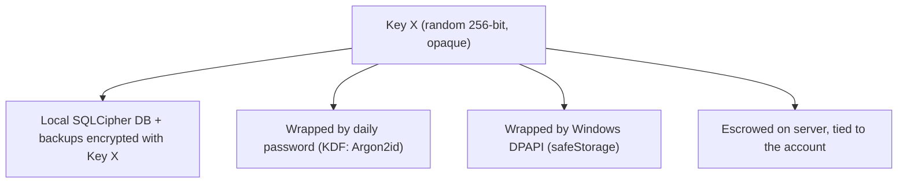
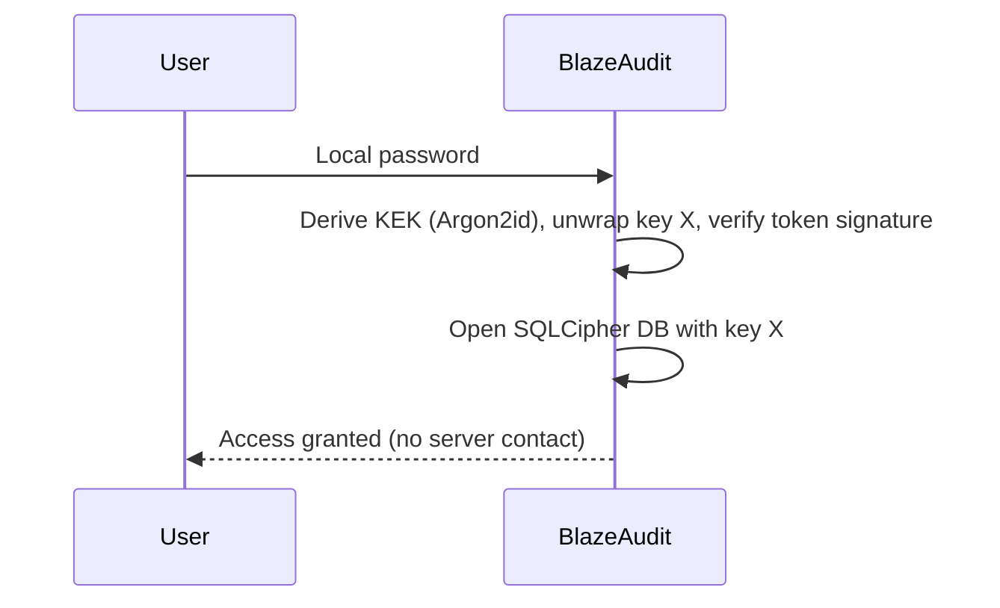
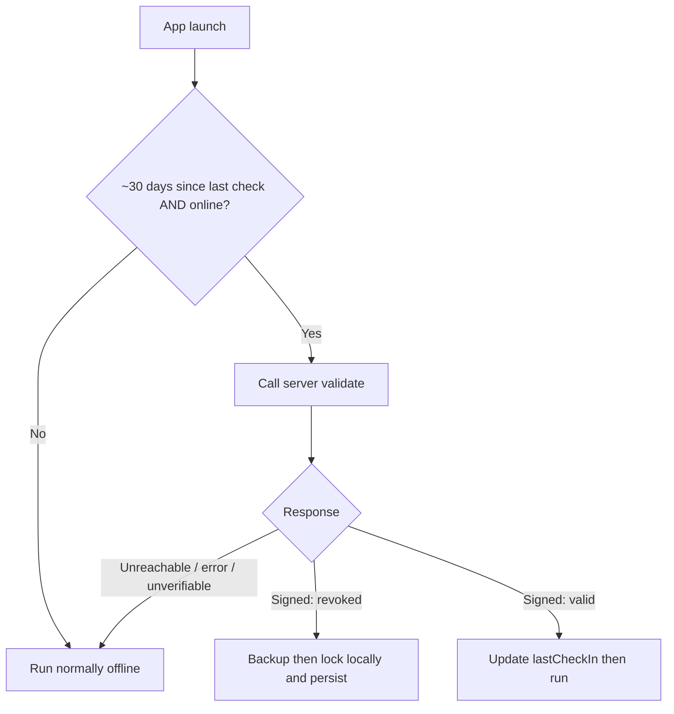

# BlazeAudit — Security, Activation & Recovery Design

> **BlazeAudit** is a product by **SubraLab**.

| | |
| --- | --- |
| **Status** | Living draft — provisional, expect change |
| **Last updated** | 2026-06-06 |

> This document is the detailed companion to
> [`adr/0002-accounts-activation-licensing.md`](adr/0002-accounts-activation-licensing.md).
> The ADR records *what* was decided; this document records *how* it works.
> It is a living design, not a final spec; mechanisms will be refined during
> implementation.

## 1. Goals & principles

- **Offline-first:** the network is touched **once at activation**, then again
  only for a **light monthly check**. Daily use never needs the server.
- **Authorized installs only:** SubraLab issues keys and can deactivate copies.
- **Awareness:** SubraLab learns *who/where* installs run (basic telemetry).
- **Data protected at rest:** local data is encrypted; the email is only an
  identity label, never a decryption factor.
- **Painless recovery:** a forgotten password or a new machine can be recovered by
  reissuing a key — without SubraLab reading the user's data contents.
- **Fail-open:** SubraLab outages must never lock out a legitimate user.

## 2. Core entities

- **Account** — identified by **email**.
- **Activation key** — a **single-use**, admin-issued secret that authorizes one
  install. Consumed on activation.
- **Instance** — one installed/activated app copy, identified by an **instance id**
  (UUID + machine fingerprint). **One active instance per account.**
- **Key X** — a random, opaque, **per-account** data-encryption key (e.g. 256-bit).
  Stable for the account's lifetime; **escrowed** on the server.

## 3. Key model (the heart of the design)



- The **DB and backups** are encrypted with **key X** (SQLCipher / encrypted
  `better-sqlite3` build).
- On the machine, key X is **never stored in readable form**. It is:
  - wrapped by a key derived from the **daily password** (Argon2id) for login, and
  - protected via **Windows DPAPI** (Electron `safeStorage`), tied to the OS user.
- The server **escrows the same key X** so it can be re-provisioned during
  recovery. This is what allows "same email -> old backup opens".
- **Email is not a key.** Matching email is enforced *automatically by the
  cryptography* (wrong account -> wrong key -> cannot decrypt), not by a lookup.

## 4. Activation (first run, online once)

```mermaid
sequenceDiagram
    participant U as User
    participant App as BlazeAudit
    participant Srv as SubraLab License Server
    U->>App: Enter activation key
    App->>App: Generate instance id (UUID + machine fingerprint)
    App->>Srv: key + instance id + email + app version + basic telemetry
    Srv->>Srv: Validate key is unused; bind to account; mark consumed; record who/where
    Srv-->>App: Signed activation token + key X (for this account)
    App->>App: Store token + key X via DPAPI; wrap key X with new local password
    App-->>U: Account ready (set local password)
```

- A key already consumed, or a second instance for an account that already has a
  live one, is **rejected**.
- After this, the app validates the **signed token offline** and uses key X
  locally; no further network needed for daily use.

## 5. Daily use (offline)



## 6. Backups

- **Format:** a **single encrypted file** — the SQLCipher database (or an exported
  snapshot) encrypted with **key X**. Lightweight, self-contained, portable.
- **Header:** a small plaintext metadata header stamps the **account email**,
  **schema version**, and **created-at**, so the app can show a friendly "this
  backup belongs to a different account" message. The header is **not** what
  unlocks the file — key X is.
- **Cadence:** automatic every few weeks, plus **on-demand**, plus **automatically
  before a lockout** (see §8).
- **Offsite:** the user manually copies the file wherever they like (e.g. Google
  Drive). The app never uploads it.

## 7. Recovery (forgotten password / new machine)

```mermaid
sequenceDiagram
    participant U as User
    participant Adm as SubraLab Admin
    participant App as BlazeAudit (fresh install)
    participant Srv as License Server
    U->>Adm: Request access (purchase / validation; may be free)
    Adm->>Srv: Issue new activation key for the same email
    U->>App: Activate with new key
    App->>Srv: key + new instance id + email
    Srv-->>App: Re-provision the identical key X
    U->>App: Load old backup file
    App->>App: Decrypt backup with key X (email matches by crypto)
    U->>App: Set a new local password (re-wraps key X)
    App-->>U: Data restored
```

- The **same key X** is reissued, so backups encrypted with it open cleanly.
- Activating under a **different email** yields a different key -> the backup stays
  locked. A stolen backup alone is useless.

## 8. License enforcement & remote deactivation

- **Monthly opportunistic check:** at launch, **if a connection exists** and ~30
  days have passed, the app asks the server to validate the key/instance.
- **On a verified, signed "revoked/invalid" response:**
  1. the app **automatically writes a fresh encrypted backup**;
  2. it **locks locally** — a correct password no longer opens the app;
  3. the locked state is **persisted** (DPAPI-protected) so it survives restarts,
     even offline;
  4. the user is told to **request a new activation key** to regain access
     (recovery then follows §7).
- **Fail-open (critical):** the app locks **only** on a cryptographically
  **verifiable revocation**. If the server is **unreachable, slow, returns an
  error, or the response can't be verified**, the app treats it as "couldn't
  check," **keeps working**, and retries later.



- **Accepted limitation:** a user who deliberately blocks the network cannot
  receive a revocation and keeps running within the window. This is best-effort by
  design (stop casual abuse, not a determined attacker).

## 9. License-client contract (host-agnostic)

The app talks to licensing through **one internal interface**, so the transport
and host stay pluggable (own VPS over HTTPS, a serverless function, or a managed
service such as Keygen) and can be chosen later without touching app code.

| Operation    | Purpose                                              | Returns (signed)                 |
| ------------ | ---------------------------------------------------- | -------------------------------- |
| `activate`   | Consume a key, bind instance, fetch key X + token    | activation token, key X          |
| `validate`   | Monthly check that key/instance is still authorized  | valid \| revoked (signed)        |
| `deactivate` | (Admin/server-driven) mark an instance revoked       | acknowledgement                  |

- All server responses are **signed**; the app verifies them against a bundled
  public key, so responses can't be forged and offline verification works.

## 10. Server responsibilities (separate component)

Co-hosted with the marketing site; details in [`ROADMAP.md`](ROADMAP.md).

- **Stores:** accounts (email), license keys (state: issued/consumed/revoked),
  instances (id, fingerprint, last check-in), escrowed **key X** per account, and
  **basic telemetry** (username, app version, activation time, IP-derived
  who/where).
- **Never stores:** inspection/client data or backups — those stay on the user's
  machine.
- **Admin front end:** issue/activate keys, deactivate instances, view
  account/activation/telemetry data.
- **Crown jewels:** the escrowed key store is encrypted at rest with tightly
  controlled access.

## 11. Threat model & limits

- **Stolen backup file:** safe — useless without key X (only re-provisioned to an
  install activated under the same email via an admin-issued key).
- **Stolen laptop:** data is encrypted at rest (SQLCipher); the daily password and
  DPAPI protect key X.
- **Key sharing / scamming:** single-use keys + one active instance + monthly check
  enable detection and remote deactivation.
- **Determined attacker offline:** can run within the monthly window by blocking
  the network — accepted, best-effort.
- **Server breach:** escrowed keys could, combined with a stolen backup, expose a
  user's data — hence strict key-store protection.

## 12. GDPR / compliance

- Accounts + telemetry (email, IP-derived location, machine fingerprint) are
  **personal data**. Required: a **privacy notice**, a **lawful basis**, and a
  **retention policy**. Tracked for the website/legal documentation.
- Keeping inspection data local (never uploaded) deliberately minimizes the
  personal data SubraLab holds.
