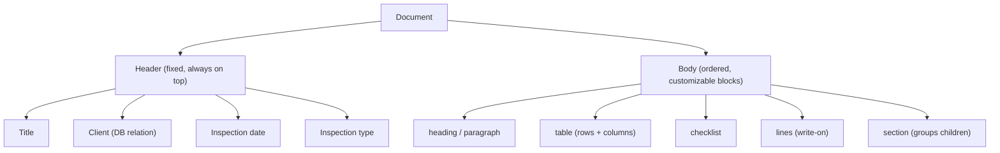
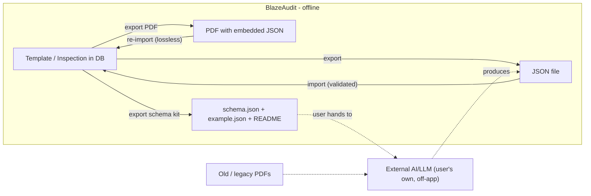

# BlazeAudit — Templates, Documents & Inspection Scheduling

> **BlazeAudit** is a product by **SubraLab**.

| | |
| --- | --- |
| **Status** | Living draft — provisional, expect change |
| **Last updated** | 2026-06-06 |

> Detailed companion to
> [`adr/0003-document-model-portability.md`](adr/0003-document-model-portability.md).
> Schema shapes live in [`DATA_MODEL.md`](DATA_MODEL.md); this document covers the
> authoring model, default templates, portability, and inspection scheduling. It is
> a living design, not a final spec.

## 1. Anatomy of a document

Every template/inspection is one document: a fixed **header** plus an ordered tree
of **body blocks**.

### 1.1 Header (fixed, always present)

- **Title** — the document title.
- **Client** — chosen from the `clients` DB table (not free text). The site
  **address auto-fills** from the client record; either start from a template and
  pick a client, or start from a client's page and attach a template.
- **Inspection date** — when the inspection was performed.
- **Inspection type** — what is being inspected (e.g. "Annual sprinkler").

Header fields live in the document's `meta` (see [`DATA_MODEL.md`](DATA_MODEL.md)
§2); the client is stored as a relation on the `inspections` row.

### 1.2 Body blocks (customizable)

Templates ship **pre-loaded** with blocks; the user can **add, remove, reorder,
and toggle** them to customize. Block catalog:

| Block        | Purpose                                              | Customization                         |
| ------------ | ---------------------------------------------------- | ------------------------------------- |
| `heading`    | Section/title text                                   | level, text                           |
| `paragraph`  | Static descriptive text                              | text                                  |
| `textField`  | Single/multi-line fill-in                            | multiline, placeholder                |
| `lines`      | Empty ruled lines to write on (esp. on printed PDF)  | number of lines                       |
| `checklist`  | Pass/Fail/NA line items                              | **add/remove lines**                  |
| `table`      | Generic data table (generalizes equipment tables)    | **add/remove rows AND columns**       |
| `signature`  | Signature + name/date                                | —                                     |
| `section`    | Container grouping child blocks; toggleable/optional | collapsible, optional; holds children |
| `spacer`     | Visual spacing                                       | size                                  |
| `image`      | Embedded image (e.g. site photo)                     | —                                     |

> The `table` block replaces the earlier `equipmentTable`: both **columns**
> (in `config.columns[]`) and **rows** (in `value.rows[]`) are user-editable, so a
> table can be reshaped for any equipment grid.

### 1.3 Editor operations

All editing is a tree mutation: add/remove/reorder blocks; add/remove **table rows
and columns**; add/remove **checklist lines**; set **lines** count; toggle
**section** visibility. Editing a template never alters existing inspections (each
inspection keeps its own snapshot).

## 2. Default templates

- A set of **default fire-inspection templates** ships with the app.
- On **first run**, they are **seeded into the DB** as normal (editable) templates.
- Bundled as JSON in the app resources; seeding is idempotent (re-seeding does not
  duplicate or overwrite user edits).
- The exact default set is an open question (see [`PRD.md`](PRD.md) §10).

## 3. Data portability

Three offline mechanisms; no in-app OCR/AI.

### 3.1 Template export / import (JSON)

- Export any template (or inspection) as a **JSON file** matching the document
  model; import reads it back, **validating against the schema**.
- Used for sharing templates between machines/users and for shipping defaults.

### 3.2 JSON Schema export kit (for external AI migration)

To bring in **old data without retyping**, the app can export a small kit:

- `schema.json` — the versioned JSON Schema for a BlazeAudit document.
- `example.json` — a real, filled example document (greatly improves AI accuracy).
- `README` / prompt — instructions telling the model to emit JSON matching the
  schema.

The user runs their **own** AI/LLM externally over old PDFs to produce JSON, then
**imports** it. This keeps the app offline and cost-free; cost, internet, and any
GDPR considerations of sending old data to a model are the user's own.

### 3.3 Embedded-JSON PDF round-trip

- Every PDF BlazeAudit exports **embeds the document's JSON** (as an attachment /
  metadata).
- Re-importing such a PDF reads that JSON back **losslessly** — no OCR, fully
  offline. (Only works for PDFs BlazeAudit itself produced.)

### 3.4 Import validation

- All imports (file JSON or extracted JSON) are **validated against the schema**.
- Invalid/partial input surfaces **clear errors** and, where practical, a
  **review/correct** step before saving — important because external AI output can
  be imperfect.

## 4. Inspection scheduling (cadence & due reminders)

- Each inspection records an **inspection date** and a **cadence** (e.g. monthly,
  quarterly, annual, or a custom interval).
- The app derives a **next-due date** = inspection date + cadence (stored as
  `next_due_at`; see [`DATA_MODEL.md`](DATA_MODEL.md) §1).
- A **dashboard** highlights **due / overdue** inspections (per client and per
  type) when the app is opened — fully offline date math.
- **Optional / later:** Windows notifications even when the app is closed (needs a
  small background/scheduled component) — a nice-to-have, not core.

## 5. Relationship to other docs

- Schema/field shapes: [`DATA_MODEL.md`](DATA_MODEL.md).
- Storage encryption and backups: [`SECURITY.md`](SECURITY.md).
- Phasing: [`ROADMAP.md`](ROADMAP.md).
- Decision record: [`adr/0003-document-model-portability.md`](adr/0003-document-model-portability.md).
