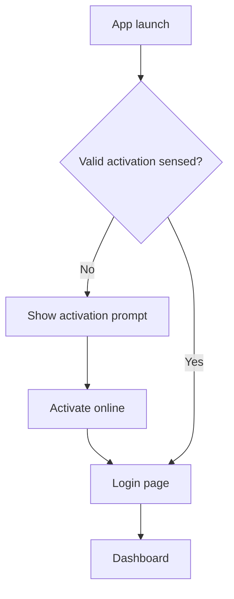

# BlazeAudit — UI & UX Design

> **BlazeAudit** is a product by **SubraLab**.

| | |
| --- | --- |
| **Status** | Living draft — provisional, expect change |
| **Last updated** | 2026-06-06 |

> A living description of the app's shell, navigation, and dashboard. Visual styling
> (colors, logo, type) is intentionally deferred to branding; this covers structure
> and behavior. Nothing here is final.

## 1. Window chrome

- **Frameless window** (`frame: false`) with a **custom top bar** that doubles as
  the **status/title bar**.
- The top bar provides standard **Windows controls**: minimize, maximize/restore,
  close — wired to the Electron window.
- The bar is **draggable** (`-webkit-app-region: drag`); controls and interactive
  elements are marked no-drag.
- Responsive layout; the chrome adapts to window size.

## 2. App entry flow



- **No activation sensed** -> show the **activation prompt** first (enter key,
  one-time online activation; see [`SECURITY.md`](SECURITY.md)).
- Once activated -> **login page**; on success -> **dashboard**.

## 3. Login page

- Clean, **responsive** login with **subtle motion** (e.g. gentle animated/gradient
  background or light moving accents) — kept lightweight for performance.
- Local password login (offline); the activation layer sits underneath.

## 4. Navigation (left sidebar)

Persistent left sidebar, top to bottom:

- **Top:** BlazeAudit logo (branding TBD).
- **Menu items:**
  1. **Dashboard**
  2. **Customers** (the client database)
  3. **Documents** (all inspections live here)
  4. **Templates**
  5. **Calendar**
  6. **Settings**
- **Bottom:** round **user avatar** + **user name**.

> Terminology: **Documents** is the single home for inspections (there is no
> separate "Inspections" item). **Templates** remain the reusable blank
> definitions.

## 5. Dashboard layout

```text
┌───────────────────────────────────────────────────────────────┐
│ [≡ logo]   top/status bar: time-aware? · — □ ✕                  │  ← custom title bar
├───────────┬───────────────────────────────────────────────────┤
│           │  Hero strip:  current time · day & date            │
│  SIDEBAR  ├───────────────────────────────────────────────────┤
│           │  Stat tiles:                                        │
│ Dashboard │   [Clients] [Done this year] [Due this week] [Due  │
│ Customers │    this month]                                      │
│ Documents ├───────────────────────────────────────────────────┤
│ Templates │  Reminders (pop-out user notes)                     │
│ Calendar  ├───────────────────────────────────────────────────┤
│ Settings  │  Body tiles (stats) + Recently used clients +      │
│           │   Recently used documents                          │
│           │                                                     │
│ [avatar]  │                         [ + New Inspection ]        │  ← near bottom
│  name     │                                                     │
├───────────┴───────────────────────────────────────────────────┤
│ Status bar: version · © BlazeAudit · SubraLab info · link      │
└───────────────────────────────────────────────────────────────┘
```

### 5.1 Hero strip
- Shows the **current time** and **day/date** (a friendly, glanceable header).

### 5.2 Stat tiles (top row)
- **Number of clients**
- **Inspections done this year**
- **Inspections due this week**
- **Inspections due this month**

(Due counts derive from each inspection's `next_due_at`; see
[`DATA_MODEL.md`](DATA_MODEL.md) and [`TEMPLATES.md`](TEMPLATES.md) §4.)

### 5.3 Reminders
- A section of **simple user-added notes** that **pop out** for attention.
- Free-form quick notes (add/dismiss); not tied to a specific record.

### 5.4 Body tiles + recents
- A few **stat tiles** (proposed, trimmable): **overdue count** (highlighted),
  **completion rate this month**, **busiest client**, **upcoming this week**
  mini-list, **last backup date**.
- **Recently used clients**.
- **Recently used documents**.

### 5.5 Primary action
- A prominent **New Inspection** button near the bottom of the main area.

## 6. Status bar (bottom)

- App **version**.
- **© BlazeAudit** and **SubraLab** info.
- A **link** (e.g. to the website/support).

## 7. Related docs

- Security/activation/login: [`SECURITY.md`](SECURITY.md).
- Documents/templates model: [`TEMPLATES.md`](TEMPLATES.md).
- Architecture & feature areas: [`ARCHITECTURE.md`](ARCHITECTURE.md).
- Phasing: [`ROADMAP.md`](ROADMAP.md).
